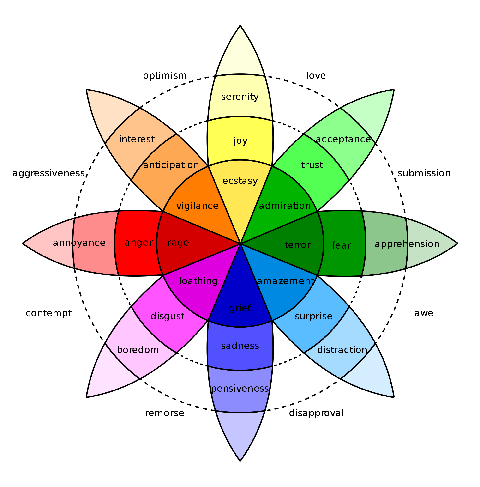
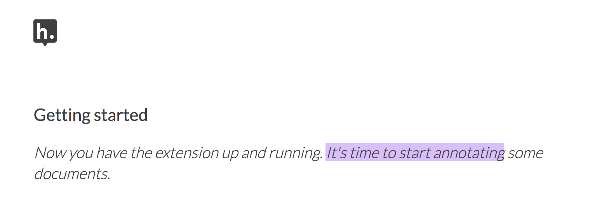

## 8.14.19 Color Classes

Am able to change highlight color by passing a CSS class into "highlightRange", in the file [index.coffee](code_notes/notes_index.coffee), having configured the color in variables.scss and set it to the "annotator-hl" class in [annotator.scss](../code_notes/notes_annotator.scss). I can also pass custom classes (for example, "blue" instead of "annotator-hl") and multiple classes (eg, "blue" and "yellow") into highlightRange.  

However, I need to find a way to tie the color classes to the button (from the dropdown menu) that's being clicked. Basically, I need to pass a specific color class into index.coffee, where it now only has the general annotator-hl class, or whatever class I put in that slot. Custom classes work, allowing me to change colors, but I coudln't get multiple colors in there. 

Perhaps the answer will be to configure all colors in the annotator.scss file, finding some way to choose one color over another, and then passing that color as the CSS class. Can I write a script for this? What would it look like and where would it go?

Another route could be to look at the onHighlight option in guest.coffee. That event listener is tied to the adder button, which is now expanded to include the dropdown. Is there a way, somewhere down the line, that I could separate out or indicate the different buttons of the highlighter? Perhaps a thingy that loops through the buttons, finds the selected one, and then passes the associated class? 

I should probably read up on passing multiple css classes into components, as well as some advanced CSS. 

## 8.11.19 highlightRange

Now that I have a better sense of the code here, I can play around with highlightRange and passing arguments. 

As Joe mentioned, this line of code is the exploit where I can pass a second parameter, a CSS class, which is configured as default "annotator-hl" in the index.coffee file, but not actually passed in guest.coffee. The default param takes us to **annotator.scss**, which is a file that configures the sidebar that pops out whenever there's a highlight as well as the highlight itself. The relevant section of the code is the following:

		//HIGHLIGHTS///////////////////
		.annotator-highlights-always-on {
		.annotator-hl {
			background-color: $highlight-color;
			cursor: pointer;
		}

		.annotator-hl .annotator-hl {
			background-color: $highlight-color-second;
		}

		.annotator-hl .annotator-hl .annotator-hl {
			background-color: $highlight-color-third;
		}
		}

		.annotator-hl.annotator-hl-focused {
		background-color: $highlight-color-focus !important;

		.annotator-hl {
			background-color: transparent !important;
		}
		}

Here, according to Joe, I could add more classes, one for each of the highlighter colors.  

## 8.8.19 Understanding Guest.coffee

This is a hell of a large file written in coffeescript, a streamlined dialectic of javascript that's easier to read and write. This is the file that Joe drew my attention to for the majority of our meeting. It configures all the commenting and highlighting, describing how these actions are carried out. 

I spent some time trying to understand the file as a whole, but since it's so big, I had to break it up. After getting a general sense of the file, I then outlined the parts of the code relevant to highlighting (which Joe pointed out to me). I was able to get a better sense of how the highlighting is processed here, through specific functions and calls. Things really started to come together when I followed the code backward, starting from the end, and working my way up to the event handler in **adder.js**. 

Main things to remember about **guest.coffee**: 

The onHighlight option called in **addder.js** here initiates a call to createHighlight which passes "true" for highlight into a larger function called createAnnotation. It's in this function that highlightRange runs with potentially three arguments, which I can configure in **index.coffee**. Joe suggested that I pass a CSS class into this function as a third parameter, which specifies the color of the highlight. That's it!

## 7.25.2019 Functionality Overview

Now that I'm in a good place with cosmetics, I'm looking at functionality. According to my last conversation with Joe, there are three files that do the bulk of the highlighting. These are **adder.js**, **guest.coffeee**, and **index.coffee**. For the past couple of days I've been going through parts of these files to understand what they do as a whole. After that, I'm going to look at the relevant pieces of code (which Joe helpfully pointed out to me) where the highlighter is called and configured. First, though, an overview:

**adder.js**:
- This file carves a space for the adder toolbar to function on the webpage. It sets up basic functionality for clicking on the adder. In more technical terms, it creates a shadow DOM that controls the appearance of the adder, and an eventlistener for the highlight button. This call takes us to guest.coffee.

**guest.coffeee**: 
- This large file configures the commenting and highlighting actions that occur in the adder. It goes into complexity describing animation promises, anchors, metadata, visibility, deletion, etc, that go into retrieving and displaying annotations.

**index.coffee**:
- This short file describes some classes that have to do with the highlightRange. Joe said this will be where I pass my custom CSS class that includes color. 

## 7.16.19 Styling the Dropdown IV: Label-less Icons

After much difficulty, I've decided to forgo the label, and have the highlighter icon on its own, in the relevant color. I realized this possibility when playing around with different sizes, when the simplicity of the icon appealed to me. It also accords with what I've said before regarding Jon Udell's script to "tag" annotations with color. My project is moving away from using verbal cues / engaging in verbal reactions. So having the color itself be the interface makes sense, because the person engages directly with that color. 

An issue here would be accessibility. Maybe I could somehow add a tag or something that makes the name of the color available when necessary. 

But for now, it's time to move on to functionality. I'll come back to this after I solve that central problem. Here's the annotator-toolbar now:

<image src="../images/dropdownlabelless.png" width="400">

## 7.13.19 Styling the Dropdown III
Moving on impossible. Still obsessed with this issue about the icon color. Looking back at my CSS notes from the Frontend workshop I took last month, I may have some ideas. I should read up on: 
- descendant selectors - can these be used to modify existing classes/elements?
- mixins:
	This is the mixin for icons:
	element {
	@include icons {
	color: red; // Make any icon red.
	}
	}

## 7.11-12.19 Styling the Dropdown II

Still working with the appearance of the dropdown. Was able to move its position (so it doesn't overlap at all with the adder), and to add highlight icons to each button. Took me a while to find the icon in the codebase, which uses icomoon. Turns out I just had to copy and paste the icon "class" in another part of the button element.

The next step, coloring the icons, proved extremely time consuming. I wanted each icon to display the color indicated in the colors label. First, I spent a lot of time trying to find the source of the icon to change the color, ended up going on icomoon, from where I still couldn't figure out how to do it. I also tried a bunch of different css solutions, coloring the h-icon-highlight to red, for example. This worked, but it made all the icons red. There's no way for me to do this just to one icon. 

I finally ended up by using in inline css rule in the html to color the entire button. This is less elegant than I hoped, but at this point I need to move on. I'm going to leave it as is and start thinking about functionality. 

Here's what the dropdown looks like now:

<image src="../images/dropdownstyled.png" width="400">

In case I want to get back to this later, see the following: 
- https://css-tricks.com/almanac/properties/f/fill/
- https://frontstuff.io/multi-colored-svg-symbol-icons-with-css-variables 

## 7.6.19 Styling the Dropdown

Today I spent more time playing around with the buttons on the adder.scss and adder.html files. There was lots of confusion about the function of various classes, and why they are attached to specific elements. For example, why are some classes attached to the span element, and not the button? Why is the "data-action" attribute attachted to span and not button?

I styled the button in a way that's more attractive, trimming down the size of the dropdown menu so it doesn't totally overlap the button. Also, I got the dropdown menu to *work*, which I wasn't expecting. When you click on either "Blue", "Red", or "Yellow", the thing will highlight in purple. Pretty cool. 

Next step would be to get the dropdown menu to appear below the adder buttons. Then to work on the font, and maybe adding an icon for each color. 

## 7.5.19 Creating a Dropdown

The advice I've been given for the next step is to create a dropdown menu off the adder which will give options for annotating in different colors. 

After playing around with it and looking at samples online, I managed to throw something together. I've added a third button to the adder menu, labeled "colors", which expands into a dropdown menu when you hover over it. The dropdown has three labels: blue, red, and yellow (primary colors). Of course the dropdown buttons don't work yet.

*The new adder button, with "colors":*

<image src="../images/colorsbutton.png" width="400">

*And with the dropdown menu activated:*

<image src="../images/dropdownmenu.png" width="400">

As you can see, the dropdown is pretty ugly. The next step is to style the dropdown so that it is consistent with the rest of the adder style. Then I'll worry about functionality. 

## 5.2.19 Meeting with Joe

Last week, Joe was nice enough to meet with me to discuss potential directions for modifying Hypothes.is. Below are the notes from our meeting, and some suggestions for next steps. 

First, I came to Joe with the following files, where I had been spending most of my time, and which define and animate the "adder," or the highlighter/commenting toolbar. As far as I could tell, there are four documents that define this "adder":

- "**adder.html**" - this is the short html file for the buttons, both the "Annotate" and "Highlight" button that pop up together once you make a text selection. I was able to make more buttons (which didn't actually work when pressed) on the toolbar by duplicating the html within the file.
- "**adder.scss**" - this is the styling for the adder, including labels, colors, animations. I was able to change the color/appearance of the adder buttons by messing around here, calling new colors from the variables file.
- "**variables.scss**" - this defines all the colors to be used in the UI. Starting at line 124, I was able to change the color of the highlighter, from yellow to purple, and it worked. I was also able to create a new palette for purple that I called throughout the adder.scss file. 
- "**adder.js**" - this is the javascript that runs the adder, navigates the DOM, manages its visibility, and a whole lot of other stuff I do not understand. 

Up to now, I've been messing with **adder.html**, **adder.scss**, and **variables.scss** in order to expand the adder toolbar for more buttons which indicate different colors that you can apply to highlight the selection. However, while I'm able to create more buttons on adder.html, just by copy/pasting the html code for the "highlight" button and styling them, *I've not been able to affect the selected text itself*---that is, the text on the page that I want to highlight---*beyond just changing the default highlight color*. In other words, I'm able to change the default highlight color to purple (or whatever color), but I cannot add more than one color, or more than one working highlighter button, because then the tool just breaks. I assume the issue is with the **adder.js** file, which I don't really understand.

Joe's response to me was enlightenting, because it turns out that the bulk of adder is actually configured in a file called **guest.coffee**. Joe explained that in this file also uses code from **highlighter/dom-wrap-highlighter/index.coffee**. According to Joe, the code works in more or less the order below:

	adder.js:
	176: handleCommand(event, options.onHighlight)

	guest.coffee:
	57: this.adderCtrl = new adder.Adder(…) #onHighlight calls self.createHighlight() on line 63
	354: this.createAnnotation({$highlight: true})
	348: targets.then(-> self.anchor(annotation))
	293: anchor = locate(target).then(highlight) #we care about call to highlight
	240: highlights = highlighter.highlightRange(normedRange) #doesn’t pass cssClass as second param

	highlighter/dom-wrap-highlighter/index.coffee:
	line 10: highlightRange() #could be passed cssClass

So I'm going to type out this process line by line:

adder.js:

176: 

**handleCommand(event, options.onHighlight)**

The event listener, a constructor with two parameters, which creates an object with parameters "event" and "onHighlight", that guest.coffee file then figures out what to do.

guest.coffee:

63:

**self.createHighlight()**

onHighlight option from adder.js calls "self.createHighlight()"

354: 

**createHighlight: -> this.createAnnotation({$highlight: true})**

Defines the funciton "createHighlight" to "createAnnotation".

348: 

**targets.then(-> self.anchor(annotation))**

For the targets, runs a method called "anchor".

293: 

**anchor = locate(target).then(highlight)**

Makes a call to highlight, which we care about.

240: 

**highlights = highlighter.highlightRange(normedRange)** 

Calls variable "highlighter" (which is a module), doesn’t pass cssClass as second param, which we might pass.

highlighter/dom-wrap-highlighter/index.coffee:

line 10: 

**highlightRange()**

This could be passed cssClass

According to Joe, the best entryway is on line 240 of the guest.coffee file. I could do the following: 
-  Have something in line 240 of guest.coffee that sends the color of the specific class to the **highlight** variable. Make a CSS class to pass as a second parameter to highlightRange. 
	- Create a dropdown in menu in HTML, with one option for each color. The new code in guest.coffee would then grab back that value on line 240.
	- Create a CSS class to highlightRange, in adder.scss and/or variables.scss, make one class for each color, then combine into one class which is passed into line 240. 
	- Inspect HTML and respond to it, so you will know what class to pass in 240.
- Or have a switch statement for each color, passing the class to 240. 

Some miscellaneous notes from our meeting:  
- adder.js 168-172, has an event listener with a dependency injection ("when this happens, do this"). QuerySelector(HIGHLIGHT_BTN_SELECTOR), is the first thing that makes the class. It searches the page for HIGHLIGHT_BTN_SELECTOR being clicked. 
- this.element is the adder box.  
- Think of this project as three parts: Get colors, Save colors, Retrieve colors. Once I figure out how to get colors, I will need to figure out saving (appending metadata, color) and retrieving. 
- to understand guest.coffee and saving/retrival, read up on Promises and Events.
- Working with asynchronous javascript. 

## 4.19.19 Charting the Click, part II

About a month ago, I began the process of "charting the click", from which I got sidetracked. After spending more time looking at the code, and after succeeding in making some changes to the UI, I'm going to give it another shot. 

First order of business is to break down the HTML file for the adder button.

	<hypothesis-adder-toolbar class="annotator-adder js-adder">
	  <hypothesis-adder-actions class="annotator-adder-actions">
	    <button class="annotator-adder-actions__button h-icon-annotate js-annotate-btn">
	      Annotate
	    </button>
	    <button class="annotator-adder-actions__button h-icon-highlight js-highlight-btn">
	      Color
	    </button>
	    <button class="annotator-adder-actions__button h-icon-highlight js-highlight-btn">
	      Color Again
	    </button>
	  </hypothesis-adder-actions>
	</hypothesis-adder-toolbar>

This file (adder.html) is rather small but it packs a lot of information. Let's start with the first element, the 

**hypothesis-adder-toolbar**
- an HTML object that encompasses ... **hypothesis-adder-actions**, which contains two buttons for "Annotate" and "Highlight".
- the classes in this object, **annotator-adder** and **js-adder**, link to the adder.scss and adder.js pages. The SCSS page contains directions for animating the adder when the User makes a text selection, including fading-in, popping up, orientation. The JS page has directions for showing and hiding the adder. For example, from the SCSS page:
		.annotator-adder--arrow-down.is-active {
		  animation-name: adder-fade-in, adder-pop-up;
		} 

**buttons**
- there are two of them, for "Annotate" and "Highlight"

To be continued.... 

## 4.9.19 Making A Purple Button

Today I spent some time messing around with the CSS and HTML files for the Adder (adder.scss & adder.html), and the Variables files (variables.scss), which defines all the colors in the H Client. The end result was an Adder button that includes the label "Color" rather than "Highlight", and a highlighted text that appears purple. I also played around with making the labels and icons temporarily purple, which was fun but ulimately unproductive.

This is a small step, but it's a key one. Next I'm going to try to expand the adder toolbar to include more buttons, hopefully with different colors. As of now, when I try to expand the buttons (by copying/pasting a new button below the original), they break. Only two of them will work at a given time. 

## 3.29.19 Layering Colors and Anchoring: NeMLA and Udell

It's been a couple of weeks since I worked on this. Mostly because I've been busy preparing a conference paper on this project, which is still mostly theoretical at this point. I'm uploading [the full paper here](../papers/NeMLA_talk_March2019.pdf), but I thought I'd take some space below to summarize my key takeaway from the conference paper, which shows where my thinking is heading on this project (my thoughts being far ahead of my practical accomplishments so far).

> A way that I am interested in using color is by 
> assigning different affects to specific colors, 
> using color theory as a guide. 

> Here, you see pictured a “wheel of emotions” 
> by Robert Plutchik, a professor of psychology, who 
> transposes his own theory of emotions into a color 
> wheel. The differences in hue on the wheel indicate 
> changes in quality, and differences in saturation 
> indicates changes in intensity, of emotion. There 
> are eight primary emotions, which run along the 
> second ring: these are joy, trust, fear, surprise, 
> sadness, disgust, anger and anticipation. The more 
> saturated colors on the inner ring represent more 
> intense forms of the emotion, while the brighter 
> colors on the outer rings are milder. For example,
> apprehension (light green) is a mild form of fear, 
> while rage (dark red) is an intense form of anger. 
> Plutchik also theorized emotional dyads, which are 
> feelings composed of two emotions. You can see the 
> dyad between fear and surprise, which is awe, or 
> between joy and trust, which is love. 

> I imagine that students might use these colors not 
> only to highlight text according to their feelings
>  or gut reactions, but also to engage with other 
> students’ highlights in the form of layering. One 
> of the benefits of the Hypothes.is highlighter is 
> that it builds a degree of opacity to each 
> highlight, so that multiple highlights on the same
> piece of text will appear more saturated, and that 
> colors can mix into secondary and tertiary 
> combinations. I wonder what would happen, for 
> example, if one student were to highlight a piece 
> of text as orange, for “anticipation”, and another 
> were to highlight that same piece as red, for 
> “anger”. The resulting dyad, which would be 
> red-orange, signifies “aggressiveness” on the 
> chart. How does this result change the way we read 
> the text? Does engaging underlying feelings that 
> occur during reading enhance the way we understand 
> we understand language or literary devices? My 
> sense is that confronting and attending to these 
> feelings will open up ways that students connect to 
> what they read. 

Today, in the New Media Lab, I took some time to read [this incredible article](https://web.hypothes.is/blog/do-it-yourself-anchoring-and-the-evolution-of-the-hypothesis-toolkit/) by H developer, Jon Udell, once again, very slowly. In it, Udell uses Hypothes.is tagging (via anchoring) functionality in order to attach highlights to annotated text. 

I spent most of my time trying to understand how the simple script works, looking up the various libraries and functions to try to wrap my mind around it all. 

I learned a lot about Javascript just by googling different parts of the script. And I also outlined the parts of the script in my [Javascript Notes](javascript_notes.md)

The main takeaway here is that Udell's script uses *anchoring*, *tagging* and *wrapping* to append colors to highlighted text. Ultimately, he uses inline CSS ("background-color") to "tag" (.wrap()) the text (as an HTML element with &lt;span&gt;) with color. Here is the last line of the code:

>	$(nodes).wrap('&lt;span style="background-color:' + tag + '" title="' + text + '"&gt;&lt;/span&gt;')

This idea is very interesting, but it isn't exactly what I want to do, which is to create a separate interface element for selecting colors. As you can see from my conference paper, the divorce of color from text is central to my project, which explores how nonverbal or preverbal affects engage the reading process. I would rather, then, that the user select a color by clicking a color instead of typing a word. That being said, it's impressive how Udell's code manages to use Hypothes.is built-in anchoring functionality in order to easily attach colors to text.  

## 3.15.19
From the Lab

Today I am tempted by a little bit of an ambitious goal. I'm would like to (hopefully) begin building the new component of the interface which will contain the option for multiple highlighters. This is the crux of my project. 

How to proceed with achieving this goal? I doubt I can do it in one day. I ought to break it down into steps, according to Agile Methodology principles.

I think the first step is to roughly chart the process of the user's selecting text, the "adder toolbar" (as it's called in the code) appearing on the screen, and then activating the highlighter element to change the color of the selected text. After getting a sense of the relevant code from the Client repo, I can then start sketching the elements of my own. 

So first, I will *chart the click*:

The click here means the process that occurs when a user clicks the mouse button and pans over a piece of text, then releases the mouse button. In the process of making the selection, the text is blue, but once the mouse button is released, it becomes yellow.

... to be continued

## 3.8.19: Making it Purple
From the Lab

The goal for today is simple---to change the highlighter color from YELLOW to PURPLE on the development version in the lab. 

I'm looking at the CSS file for the adder. It's in the variables.scss file, in the styles directory (src/styles/variables.scss). The highlighter is defined thus:

	$highlight-color: rgba(255, 255, 60, 0.3);

Now I need to look a little bit at RGB color schemes, with some help from w3schools. This is the the Red-green-blue-alpha (RGBA) model. Turns out these color values are an extension of RGB color values with an alpha channel that specifies the opacity of the color.  The red defines an intensity of red as an integer between 0 and 255 (it can also be represented as a percentage), and the same goes for green and blue. The alpha defines the opacity as a number between 0.0 (fully transparent) and 1.0 (fully opaque).

I'm trying purple (technically, Electric Indigo) which I got from this [website](http://www.flatuicolorpicker.com/purple-rgba-color-code). Though I'm changing the opacity to .3, to match the original. This is the code:

	rgba(140, 20, 252, .3)

And here's what I got! See how the highlight is purple?

This color change didn't actually show up until I quit everything, restarted the dev server, and unpacked the extention. It seems like that will always have to be my process to see changes. 

Besides this change, I also spent some time today learning more about Git. Since I'll be using it on two computers (my own and the lab's) I need to be careful about keeping the remote repository updated with the current version. This was easy enough to do after some googling. 

	$ git remote add [urlformyrepo]

When I get back to my home computer, I will have to run this to download all the data from the remote:

	$ git fetch <remote>

And then initialize(?), add, commit, push as usual. More info on these steps can be found [here](https://git-scm.com/book/en/v2/Git-Basics-Working-with-Remotes).

One issue is whether or not I should create branches / learn about branching / the other functionalities of Git. It seems like a pretty steep learning curve, so I'm not completely sure. 

## 3.7.19 Replicating development environment
on home computer

Went through all of the instructions, which were fine except when I start try to unload the unpacked extension, and select build. I get this error window in Chrome:

    Failed to load extension
    File
    ~/Desktop/browser-extension/build
    Error
    Manifest is not valid JSON. Line: 1, column: 1, Unexpected token.
    Could not load manifest.

Also, when I try to run this code in the terminal:

    cd ~/Desktop/browser-extension # or wherever it is
    make SETTINGS_FILE=settings/chrome-prod.json

I get this error:

    Error: cannot create production build with dirty git state! 

### Update: I figured it out!

After some searching around the annotations on the docs, I found a workaround to fix the dirty git error (requiring me to comment out some code in browser-extension/tools/settings.js). This ended up making the code run without error and allowing me to unpack and load the extension. 

Was also able to see the changes in the development version by changing some code (in the adder.html), saving and closing/killing everything, then restarting the dev and unpacking the extension.

## 3.1.19: Setting up my development environment
Day One at the New Media Lab. 

Today Joe and I tried following the [Client development instructions](https://h.readthedocs.io/projects/client/en/latest/developers/developing/) on the H docs. There were a bunch of issues, mostly to do with NPM, which you can read about [here](https://docs.npmjs.com/downloading-and-installing-node-js-and-npm) and [here](https://docs.npmjs.com/resolving-eacces-permissions-errors-when-installing-packages-globally). From what I can gather, Node requires you to install it globally. As a result, every time we ran NPM we encountered a bunch of errors. 

It took us (mostly Joe!) about an hour and a half attempting to install the client and browser-extension this sloooow way before we finally doubled back and started over with a non-problematic installation of node. This involved deleting the repos from Github and starting over, installing the dependencies (node) via the NVM (node version manager) rather than NPM. The instructions are below:

	# in shell:
	[sudo] npm install npm -g
	mkdir ~/.npm-global
	npm config set prefix '~/.npm-global'

	# append to OR make a file at ~/.bash_profile including the content:
	export PATH=~/.npm-global/bin:$PATH

	# close terminal tab and open new one
	echo $PATH
	# ensure that ``~/.npm-global/bin` is included in results

	cd ~/Desktop # or wherever
	git clone 'https://github.com/hypothesis/client.git'
	cd client
	npm install -g gulp-cli
	make dev # kill with control-c

	cd ~/Desktop # or wherever
	git clone https://github.com/hypothesis/browser-extension.git
	cd browser-extension/src/
	npm install
	cd ..
	make
	npm test # should show summary of tests completed without error

	cd ~/Desktop/client # or wherever it is
	npm link

	cd ~/Desktop/browser-extension # or wherever it is
	npm link hypothesis

	# extensions reloader --- download to streamline updating changes to extentions

	install https://chrome.google.com/webstore/detail/extensions-reloader/fimgfedafeadlieiabdeeaodndnlbhid?hl=en

	# To start up,  and kill with control-c

	cd ../browser-extension/ && make SETTINGS_FILE=settings/chrome-prod.json && cd ../client/ && make dev

	## install extension in Chrome, toggle developer options, load unpacked extension, and select build. 

	cd ~/Desktop/browser-extension # or wherever it is
	make SETTINGS_FILE=settings/chrome-prod.json

	##	save as file ending in .bash with permissions 755 (chmod 755 [file_name])

	#!/bin/bash
	cd ../browser-extension/
	make SETTINGS_FILE=settings/chrome-prod.json
	cd ../client/
	make dev

This made things run a LOT smoother, though there were still issues with getting the extension to show up in the browser, which Joe fixed by changing file paths and/or running make SETTINGS_FILE=settings/chrome-prod.json in the browser extention. 

After a lot of trial and error, we finally got it to work, verified by changing the text in the hypothesis adder to reveal some gobbeldygook. This was extremely exciting. 

The major takeaway here is how difficult / how many steps I have to take in order to make a few changes to the javascript. The whole process would have been impossible without a professional helping me through it. Thankfully, Joe was here, patient, and willing to sit with me for three hours. I am so grateful. 

## General Resources
Article on [Fuzzy Anchoring](https://web.hypothes.is/blog/fuzzy-anchoring/)

## To start up development, and kill with control-c
cd ../browser-extension/ && make SETTINGS_FILE=settings/chrome-prod.json && cd ../client/ && make dev
