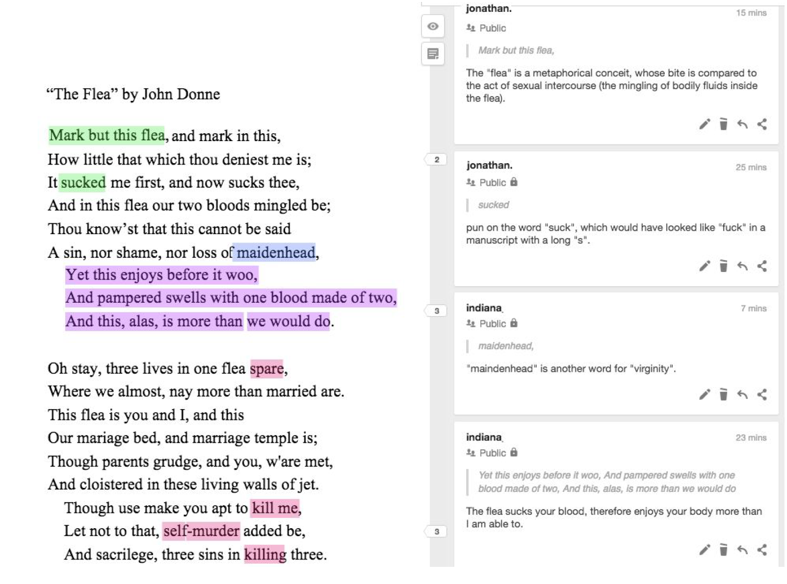
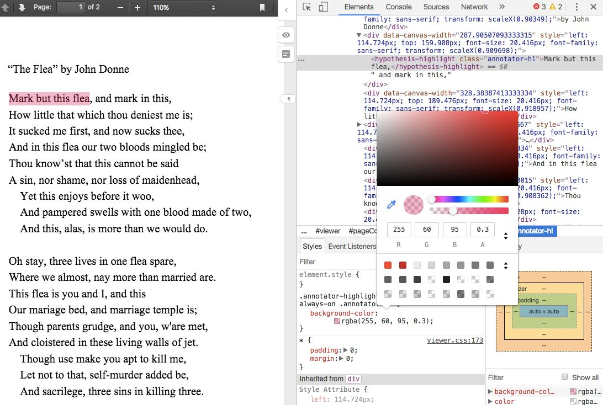

# Proposal Summary (with slight revisions)

## Problem

While existing digital annotation tools are useful for teaching close and critical attention to language in the english classroom, I find myself more interested in accessing other kinds of responses to reading. I wonder how we might expand "active reading" practices associated with digital annotation to also include *affects* that engage embodied and nonverbal responses to texts, including instinctual and emotional reactions to reading. 

## Proposal

I propose an option for color-coding annotations that would allow students to express and confront their more immediate feelings and reactions while reading. Not only does this tool prompt students's access to feelings and nonverbal reactions, but also provides an opportunity for engaging critically with them. Students may use colors as flexible categories that indicate different areas of understanding---such as figuration, themes, or syntax. And, by customizing the color of their highlights, students may begin to understand how their feelings can be part of a larger, more formalized analytical process.

[why are feelings important?]

I will develop this feature from, Hypothes.is, a digital annotation tool that allows users to highlight and comment directly on web pages or PDFs. There are multiple ways to deploy Hypothes.is---it can be installed as a web application, as a client, or as a browser plugin, which works on both Firefox and Google Chrome. For my project, I will install a version of client, which can be embedded directly into my wordpress site.

## Critical Engagements

This tool engages with current debates in educational technology, or "edtech", that question the role of quantification and tracking in student learning. The effects of quantification range from exploitative to harmful, as Audrey Watters explains in her extensive investigations on the dangers of collecting information on students. According to Watters, tracking students not only makes them vulnerable to those who would profit from them economically, but also reduces them data points and labels, such as “at risk” (["Edtech and Trump"](http://hackeducation.com/2017/02/02/ed-tech-and-trump)). Tools that aim to quantify student learning target what is most easily quantifiable, such as test scores, and edtech producers market such these tools for their ability to improve student performance. Amelia Abreu explains the delusions behind the "Quantify Everything" movment, which assume that "If we can develop the perfect measurement for an object and its functions, nothing can be out of order, and we all can achieve a sort of equal footing" ([“Quantify Everything: A Dream of Feminist Data Future”](https://modelviewculture.com/pieces/quantify-everything-a-dream-of-a-feminist-data-future)). Amelia Abreu rightly points out that such quantification practices often leave out that which is difficult to track, such as emotional labor and struggle. 

In pushing back against such trends in quantification, my project focuses on affects that cannot be readily quantified, which has been discussed in scholarship on college composition pedagogy. In his book *Engaging Ideas*, John Bean suggests instructors organize their lessons around “problems”, specifically, “beautiful problems... [which] create natural critical learning environments” (3). He explains that good writing assignments provoke a kind of productive discomfort, and that academic writing ought to capitalize on this “intellectual and often emotional struggle” (23). Throughout his work, I’m most influenced by power that “wonder”, “discomfort” and “struggle” have in stimulating thinking. Bean's attention to these affects encourages me to dwell more deeply on their power prior to verbalization in traditional composition practices.

N. Katherine Hayles, in her seminal book, *How We Became Posthuman*, has been a continued
influence in how I think through human interaction with machines, particularly on the tension
between embodiment and disembodiement. In this book, Hayles traces the idea, descendant from eighteenth century liberal humanism, that knowledge and feelings can exist independently of the body. She examines philosophical trends that prioritize rationality in the human, and extend into conceptions of the posthuman, which imagines the body as a prosthesis of the mind. In thinking about Hayles’ work, I’m specifically interested in how annotation may access embodied reactions to reading, and encourage the creation of extra-verbal meaning. In other words, how can annotation connect more directly to knowledge as feeling and affect, rather than knowledge as information that exists purely in a textual form?

Reflecting on these perspectives, I propose that technology which engages emotion and affect creates an opportunity for new ways of tracking and assessing student work. Accordingly, my tool aims to encourage moments of emotional struggle and insight, rather than measurable "learning outcomes". 

## Guiding Questions

In developing the tool, I wonder how varieties of digital annotation might expand or reduce the quality of the student’s engagement with the text. I am particularaly interested in the tension between the “provocative”, that is,opening up the text to new insights, and the “prescriptive”, that is, limiting a student’s interaction with the text to a predetermined set of choices or options for responding. Accordingly, I have three questions that will guide my development of the tool:
* First, how do traditional annotation tools and practices support a prescriptive approach to teaching close reading: how do they create a standardized method or process in responding to texts?
* Second, more specifically, do certain features, such as colors, categories, or tags, for example, actually limit the kinds of responses students might have without these prompts? In other words, do these options actually create a structure that confines student thinking?
* Third, from the opposite perspective, how can giving students more nonverbal options in an annotation tool provoke them toward more spontaneous insights?

## Environmental Scan

This tension between disembodied information and embodied feeling plays out in several recent annotation projects. Below, I review some of the most relevant examples to my project.

### [Ponder](https://www.ponder.co/about/)

Ponder is a browser add-on tool that can be activated on any webpage. It shares a basic functionality with Hypothes.is, which is highlighting text and responding through a written annotation, but Ponder offers additional features that Hypothes.is does not. Most importantly, it creates options for different "reactions", called "sentiment tags", which allows students to color-code their responses according to the categories, "clarification", "analysis" or "emotion". Unfortunately, the project is proprietary, and charges a fee for its full usage.

### [Lacuna Stories](https://www.lacunastories.com/)

Developed by Standford University, Lacuna Stories is a platform, used as a central organizing space for a course and an interface for course readings. Despite this difference, the annotation component here functions similarly to Ponder: the reader highlights a section of the text, has the option of making a comment and for categorizing the type of response. Here, there are four categories, which are color-coded: “Comment”, “Question”, “Analyze”, and “Connect”. 

Unlike Ponder, however, Lacuna Stories contains a tracking mechanism for teachers to follow their students’ progress as they complete the homework and make annotations. The instructor has access to a "Dashboard" that visualizes all student activity. For example, In the "Annotation Details" section of the dashboard, a series of pie charts indicate the amount of annotations by student and the length of each annotation. Thinking back to the critical literature, I wonder how such metrics might prioritize quantity (such as word count) as an assessment criterion.

Lacuna Stories is open source and has published their code [on Github](https://github.com/PoeticMediaLab/LacunaStories). Because both Hypothes.is and Lacuna Stories build on Annotator.js, this repository will be helpful guidance as I modify my own version of Hypothes.is. 

### [Annotation Studio](https://www.annotationstudio.org/)

Created at MIT, Annotation Studio is also a platform and open source, developed off the Annotator.js project. The annotation tool here allows for media-rich annotations and custom tagging, and the user has more power to create "collections" of texts and search and organize through annotations. Though the central aim for Annotation Studio is pedagogical, intended to engage undergraduate students in close reading and interpretation, it explicitly encourages textual research: "By enabling the user to tag texts using folksonomies rather than TEI, Annotation Studio allows students to act as 'novice scholars,' discovering how literary texts can be opened up through the exploration of sources, influences, editions, and adaptations" ["Annotation Studio"](http://hyperstudio.mit.edu/projects/annotation-studio/). 

Like Lacuna Stories, Annotation Studio has also published their code [on Github](https://github.com/hyperstudio/Annotation-Studio). 

## Ideal Version

Below is an image of the tool in its ideal form. Here appears the source text, a poem by John Donne, and the annotations in the sidebar to the right. On the poem, the annotations are highlighted in different colors, which convey information about the type of annotation. For example, the annotations in green indicate literary devices (here, a metaphor and a pun); the annotation in blue indicates comprehension (here, modernizes an anachronism); the one in purple paraphrases a syntactically challenging section of the poem; and, in the second stanza, the annotations in red indicate imagery of violence, showing how the tool might engage affect.

As these examples show, the multi-color functionality can denote a variety of responses, from ones that follow the teacher’s instructions to the reader’s own subjective response. One of the challenges in developing the tool will be to think through the affordances of using color in pre-defined ways and using it more spontaneously. As stated above, I’m particularly interested how annotation practice can both limit and open up critical interventions. Therefore, while I’m building the tool, I will consider how the constraints of scaffolded annotation structure can be enabling.

## Steps to be Taken

In order to make this ideal version of the tool, I will need to go into the Hypothes.is code and alter the CSS files to include an option of multiple colors in the highlighter. The image below shows where the relevant element resides in the Hypothes.is code. Here, I used the Developer Tools console (in a Google Chrome browser) to isolate the relevant element. After isolating the element, I changed the color of the highlight by altering the hexidemical code (which defines colors) in the CSS file. Using the developer tools, I was able to change this color temporarily,which is visible in the image, from yellow to red.

To build this tool, I will have to further familiarize myself with the existing codebase for Hypothes.is, and be comfortable enough with several coding languages to make changes. Though I have implemented both Hypothes.is and Annotator.js (Hypothes.is’s parent project) in my past teaching and research, I have never built or customized anything with this level of complexity, and I’ve certainly never written code from scratch. 

At this point, I anticipate that I would need to focus on strengthening my CSS, Javascript, Python, and familiarity with WordPress.org, before getting started. I also anticipate that much of my preparation will be spent researching other annotation tools, and familiarizing myself with relevant resources, for example, the [“Annotation Tools”](https://annotation.commons.gc.cuny.edu) website by previous ITP student, Anke Geertsma.

The entire process will take somewhere between 3-6 months, with 1-2 months spent on research and 2-4 months on building and testing. I plan to complete the research phase of my project this summer, when I will have enough time to familiarize myself with the following:
*Wordpress.org 
*CSS
*Javascript
*Hypothes.is library
*Lacuna Stories, Annotation Studio & Annotator.js libraries

By the end of August, I hope to have completed a timeline for building and testing the tool during the fall semester. This timeline will be incorporated with relevant scholarly reading to create my syllabus for my independant study with Michael Mandiberg. In the fall, I will begin developing the tool, as part of my work in my indepedant study. I plan to design the project step by step, assuming that things will change. At bare minimum, I hope to create a multi-color option for highlighting. In the case that I complete this functionality before the end of the semester, I will then scale up my goals to include more interactive and engaging features. Then, I would prioritize my features in the following order: (1) color-coding options; (2) tagging options (for emotional/analytical reactions); and (3) interactive functionalities (“liking” or “voting” options). If any of these things prove too difficult to accomplish, I will then scale back the technical aspects of the project and turn to creating supplementary teaching materials about using annotation for close-reading instruction.

### Works Cited

Abreu, Amelia. ["Quantify Everything: A Dream of Feminist Data Future".](https://modelviewculture.com/pieces/quantify-everything-a-dream-of-a-feminist-data-future) *Model View Culture: A Magazine about Technology, Culture and Diversity*. February 24, 2014.

[*Annotation Studio*](http://www.annotationstudio.org/). Massachusetts Institute of Technology Hyperstudio.

Bean, John. *Engaging Ideas: The Professor's Guide to Integrating Writing, Critical Thinking, and Active Learning in the Classroom*. San Francisco: Jossey-Bass, 2001.

Calado, Filipa. [*English 220: Introduction to Writing about Literature*.](https://engl22049.commons.gc.cuny.edu/) Hunter College, Spring 2018. CUNY Academic Commons.

Geertsma, Anke. [*Annotation Tools: A Resource for College Instructors*.](https://annotation.commons.gc.cuny.edu) CUNY Academic Commons.

Hayles, N Katherine. *How We Became Posthuman: Virtual Bodies in Cybernetics, Literature, and Informatics*. University of Chicago Press, 2010. Print.

[*Hypothes.is*.](https://web.hypothes.is/) The Hypothes.is Project.

[*Lacuna Stories*.](https://www.lacunastories.com/) The Poetic Media Lab, Standford University.

[*Ponder*.](https://www.ponder.co/about/) Parlor Labs, Inc.

Watters, Audrey. [“Ed-Tech and Trump.”](http://hackeducation.com/2017/02/02/ed-tech-and-trump) Hack Education. February 2, 2017.

### Recommended reading

Levy, Sharona A., [“Reading the Reader”.](https://blogs.commons.georgetown.edu/vkp/files/2009/02/levyfinal.pdf) *The Difference the Enquiry Makes*. ed. Randy Bass and Bret Enyon. Academic Commons, January 2009.

Schneider, Emily, et al. [“Making Reading Visible: Social Annotation with Lacuna in the Humanities Classroom.”](https://jitp.commons.gc.cuny.edu/making-reading-visible-social-annotation-with-lacuna-in-the-humanities-classroom/) *The  Journal of Interactive Technology and Pedagogy*, 16 June 2016